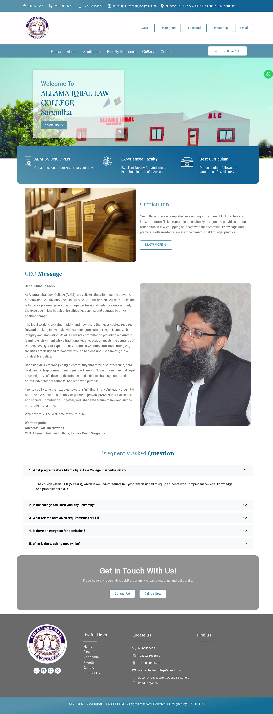
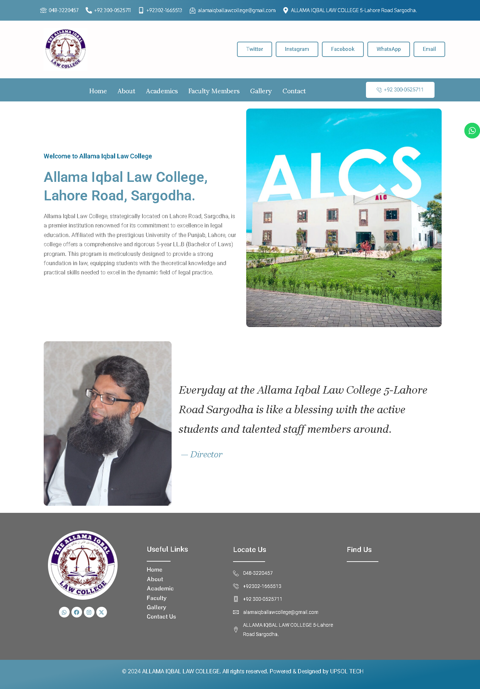
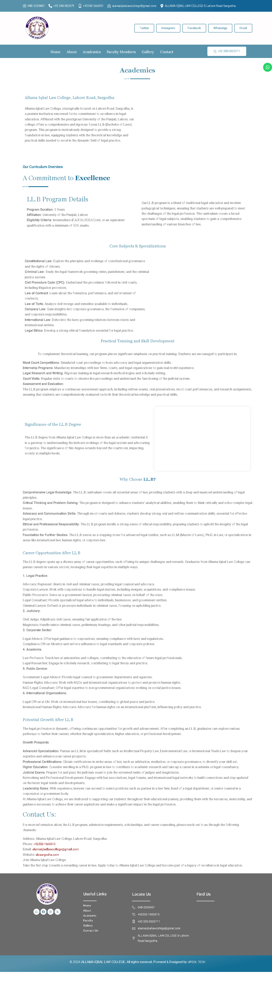
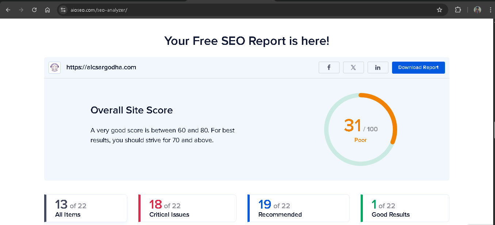
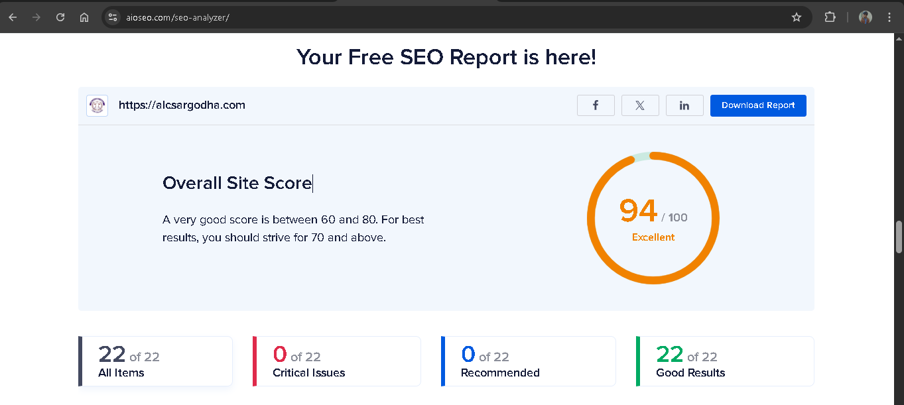

# Allama Iqbal Law College Website Project

## 📖 Project Overview  
This project involved **redesigning and optimizing** the website for **Allama Iqbal Law College, Sargodha** — a premier institution offering a 5-year LL.B program affiliated with the University of the Punjab.  

The project was successfully completed in **just 4 days**, achieving significant improvements in **design, performance, and SEO visibility**.  

---

## ✨ Key Features  
- ✅ Complete WordPress development without Elementor or page builders  
- 🎨 Custom design implementation with Canva-created assets  
- 🔍 Comprehensive SEO optimization using premium plugins  
- 📊 Keyword research & implementation for better search rankings  
- 📱 Responsive design for seamless cross-device experience  

---

## 🛠️ Technical Implementation  

### Development Approach  
- Built on **WordPress CMS** with custom theme development  
- **No visual page builders** (pure custom code)  
- Custom **CSS & PHP** for unique functionality  
- Optimized for **fast loading & performance**  

### SEO Strategy  
- In-depth **keyword research** (focus: legal education in Sargodha)  
- On-page SEO best practices across all site pages  
- Premium **SEO plugins** (Yoast SEO / equivalent)  
- Improved site structure for better crawlability and indexing  

---
## 🌐 Website Preview  

🔗 **Live Website:** [Allama Iqbal Law College](https://alcsargodha.com/)  

### Screenshots

<table>
  <tr>
    <td align="center">
      <b>Home Page</b> 
      Featuring CEO message and program info 
      
    </td>
    <td align="center">
      <b>About Page</b> 
      College intro & contact information 
      
    </td>
    <td align="center">
      <b>Academics Page</b> 
      Detailed LL.B program curriculum 
      
    </td>
  </tr>
</table>
---

## 📈 SEO Results Achieved

### SEO Score Improvement
- **Before Optimization:** 31/100 (❌ Poor)
- **After Optimization:** 94/100 (✅ Excellent)

<table>
  <tr>
    <td align="center">
      <b>Before</b> 
      <i>SEO score before optimization</i> 
      
    </td>
    <td align="center">
      <b>After</b> 
      <i>SEO score after optimization</i> 
      
    </td>
  </tr>
</table>

### Critical Issues Resolved  
- Fixed **18 critical SEO issues** from initial audit  
- Implemented **22 recommended improvements**  
- Achieved **perfect scores** in all green categories  

---

## 📅 Project Details  

- **Timeline:** 4 days (complete redesign & SEO optimization)  
- **Technologies Used:**  
  - WordPress CMS  
  - Custom PHP Development  
  - CSS3 & HTML5  
  - SEO Plugins (Yoast SEO / Equivalent)  
  - Canva (Graphics)  
  - Google Analytics Integration  

### 🚀 Challenges Overcome  
- Extremely tight **4-day deadline**  
- Full custom development **without page builders**  
- Massive **SEO score improvement** (31 → 94)  
- Balancing **design quality & SEO optimization**  

---

## 👨‍💻 Developed By  
**Sohaib Younas**  

- 🌐 [Portfolio](https://sohaibyounas076.github.io/portfolio/)  
- 💼 [LinkedIn](https://linkedin.com/in/sohaibyounas076)  
- 📂 [GitHub](https://github.com/Sohaibyounas076)  

---
